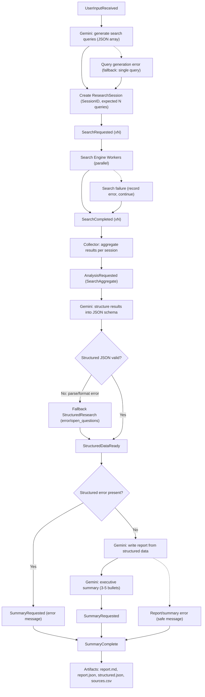
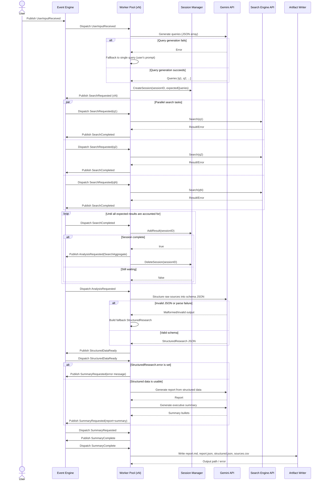

## Event-Driven Research Assistant — Task Lifecycle

## Event Lifecycle by Workers (Sequence)

## Legend (Mermaid Sequence)

- `A ->> B`: synchronous message/request from A to B
- `A -->> B`: return/response from A to B
- `alt / else`: conditional branch (if/else)
- `par / and / end`: parallel branches executing concurrently
- `loop`: repeated block until condition is met
- `participant`: system component/lifeline in the interaction
- `actor`: external initiator (e.g., user)
- `Publish <EventType>`: enqueue event into the event engine
- `Dispatch <EventType>`: worker pool picks and handles queued event