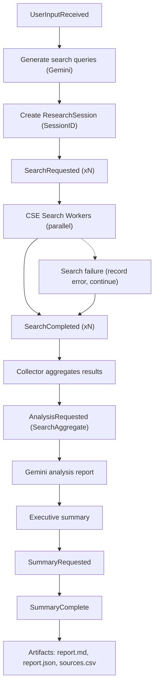

## Event-Driven Research Assistant — Task Lifecycle

```mermaid
flowchart TD
  A["UserInputReceived"] --> B["Generate search queries (Gemini)"]
  B --> C["Create ResearchSession (SessionID)"]
  C --> D["SearchRequested (xN)"]
  D --> E["CSE Search Workers (parallel)"]
  E --> F["SearchCompleted (xN)"]
  F --> G["Collector aggregates results"]
  G --> H["AnalysisRequested (SearchAggregate)"]
  H --> I["Gemini analysis report"]
  I --> J["Executive summary"]
  J --> K["SummaryRequested"]
  K --> L["SummaryComplete"]
  L --> M["Artifacts: report.md, report.json, sources.csv"]

  E -.-> X["Search failure (record error, continue)"]
  X --> F
```

