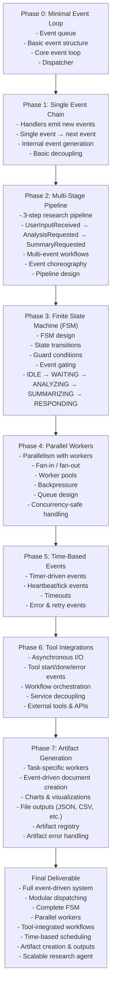

## Event-Driven Research Assistant — Mermaid Overview

```mermaid
flowchart TD
  P0["Phase 0: Minimal Event Loop\n- Event queue\n- Basic event structure\n- Core event loop\n- Dispatcher"]
  P1["Phase 1: Single Event Chain\n- Handlers emit new events\n- Single event → next event\n- Internal event generation\n- Basic decoupling"]
  P2["Phase 2: Multi-Stage Pipeline\n- 3-step research pipeline\n- UserInputReceived → AnalysisRequested → SummaryRequested\n- Multi-event workflows\n- Event choreography\n- Pipeline design"]
  P3["Phase 3: Finite State Machine (FSM)\n- FSM design\n- State transitions\n- Guard conditions\n- Event gating\n- IDLE → WAITING → ANALYZING → SUMMARIZING → RESPONDING"]
  P4["Phase 4: Parallel Workers\n- Parallelism with workers\n- Fan-in / fan-out\n- Worker pools\n- Backpressure\n- Queue design\n- Concurrency-safe handling"]
  P5["Phase 5: Time-Based Events\n- Timer-driven events\n- Heartbeat/tick events\n- Timeouts\n- Error & retry events"]
  P6["Phase 6: Tool Integrations\n- Asynchronous I/O\n- Tool start/done/error events\n- Workflow orchestration\n- Service decoupling\n- External tools & APIs"]
  P7["Phase 7: Artifact Generation\n- Task-specific workers\n- Event-driven document creation\n- Charts & visualizations\n- File outputs (JSON, CSV, etc.)\n- Artifact registry\n- Artifact error handling"]
  F["Final Deliverable\n- Full event-driven system\n- Modular dispatching\n- Complete FSM\n- Parallel workers\n- Tool-integrated workflows\n- Time-based scheduling\n- Artifact creation & outputs\n- Scalable research agent"]

  P0 --> P1 --> P2 --> P3 --> P4 --> P5 --> P6 --> P7 --> F
```

